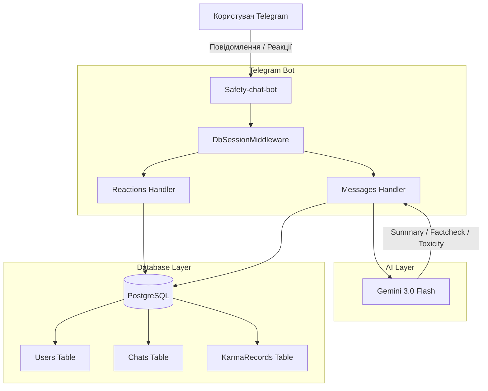

# 🛡️ Safety-chat-bot

Сучасний Telegram-бот для інтелектуальної модерації та управління спільнотами, побудований на базі **Google Gemini 3.0 Flash** та **Aiogram 3**.

## ✨ Основні можливості

- **🧠 Smart AI Модерація:** Дворівнева система захисту. Швидкі евристичні фільтри (Regex) відтинають очевидний спам, а Gemini аналізує контекст на токсичність та фішинг.
- **🔥 Нативна Карма (Репутація):** Жодного текстового спаму ("+1", "дякую"). Репутація нараховується **виключно** за позитивні Telegram-реакції (🔥, ❤️, 👍, 👏, 🏆, 💯, ⚡️) на повідомлення користувача.
- **📝 AI-Самарі (`/summary`):** Бот аналізує історію розмови та видає коротку вижимку головних подій (TL;DR).
- **🕵️ Fact-Checking (`/factcheck`):** Швидка перевірка сумнівних новин та повідомлень за допомогою штучного інтелекту.
- **⚙️ Сучасна Архітектура:** Python 3.11+, SQLAlchemy 2.0 (PostgreSQL), Alembic для міграцій, та надійна система Upsert для управління даними користувачів і чатів.

## 🏗 Архітектура



## 🚀 Встановлення та Запуск (Docker)

Найпростіший спосіб запустити бота — використовувати Docker Compose.

1. **Клонуйте репозиторій:**
   ```bash
   git clone https://github.com/webyhomelab/safety-chat-bot.git
   cd safety-chat-bot
   ```

2. **Налаштуйте змінні середовища та авторизацію:**
   ```bash
   cp .env.example .env
   # Відредагуйте .env, додавши ваш BOT_TOKEN
   
   # Помістіть ваш сервісний ключ GCP (Service Account JSON) у корінь проєкту:
   # Файл обов'язково має називатися credentials.json
   ```

3. **Запустіть через Docker Compose:**
   ```bash
   docker-compose up -d
   ```

## 🛠 Технологічний стек

- **Мова:** Python 3.11+
- **Фреймворк:** Aiogram 3.x
- **База даних:** PostgreSQL (asyncpg) + SQLAlchemy 2.0 + Alembic
- **AI API:** Google Generative AI SDK (gemini-3.0-flash)
- **Конфігурація:** Pydantic Settings

## 📄 Ліцензія

Цей проєкт ліцензовано на умовах MIT License.
