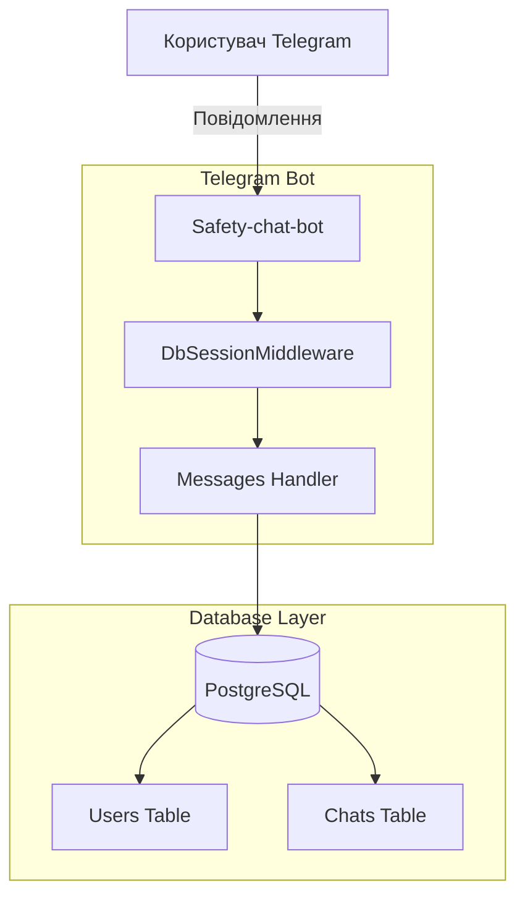

# 🛡️ Safety-chat-bot

[](https://github.com/weby-homelab/safety-chat-bot/releases)
[](https://hub.docker.com/r/webyhomelab/safety-chat-bot)
[](https://opensource.org/licenses/MIT)
[](https://www.python.org/)

Сучасний, легкий та повністю безкоштовний Telegram-бот для модерації та управління спільнотами. Побудований на базі **Aiogram 3** та **PostgreSQL**.

<details>
<summary><b>✨ Основні можливості бота (натисніть, щоб розгорнути)</b></summary>

- **🛡️ Ефективна Модерація (Оновлення 06.2026):** Потужні евристичні фільтри миттєво реагують на нові методи спаму, фішинг-посилання (через розширені списки `BANNED_DOMAINS` з короткими лінками на кшталт `is.gd`, `t.co`, `bit.do`) та ворожі висловлювання/ІПСО.
- **👥 Авто-реєстрація:** Бот автоматично реєструє профілі для нових учасників чату при їх першій активності.
- **📢 Сповіщення Адміністратора:** Автоматичні сповіщення в окремий чат адміністратора про всі ключові події модерації (пройдена чи провалена капча, видалений спам, скарги користувачів через команду `/report`).
- **⚙️ Надійна Архітектура:** Використання SQLAlchemy 2.0, Alembic для міграцій та Docker для швидкого розгортання.
- **🔄 Динамічна та безпечна синхронізація:** Інкрементне додавання нових спам-фраз та заборонених доменів до бази даних при кожному запуску без затирання користувацьких змін.
</details>

<details>
<summary><b>🛡️ Детальний опис систем захисту бота (Оновлено 07.2026)</b></summary>

Для максимальної протидії сучасним методам спаму, фішингу, порно-ботам та інформаційно-психологічним атакам (ІПСО), у системі реалізовано багаторівневу систему захисту:

### 1. Захист від додавання слейв-ботів (Anti-Master-Slave Botnet)
Один із нових векторів атак — це коли «мастер»-акаунт (зазвичай звичайний користувач без прав адміністратора) додає в чат групу «слейв»-ботів, які починають спамити, обходячи стандартні захисти.
* **Принцип дії:** Бот жорстко контролює подію `new_chat_members`. Якщо доданий учасник є ботом (`member.is_bot == True`), і особа, яка его додала, НЕ є адміністратором групи, бот миттєво **банить доданого бота** та **банить користувача-ініціатора** (мастера).
* **Результат:** Запобігає несанкціонованому розширенню спам-мережі в чаті.

### 2. Інтелектуальний пре-скринінг профілів нових учасників (Anti-Porn & Anti-RTL)
Ще на етапі входу в чат (до показу капчі та будь-яких дій користувача) бот аналізує його профіль (`first_name`, `last_name`, `username`) на ознаки спамера:
* **Порно-спам фільтр:** Блокування за наявність у імені чи юзернеймі стоп-слів, пов'язаних із порно-індустрією (`sex`, `porn`, `nude`, `dating`, `onlyfans`, `escort`, `xxx` тощо, включаючи кириличні аналоги `секс`, `знакомства`, `шлюхи`, `минет`, `сиськи`, `вирт` та транслітерації).
* **RTL (Right-to-Left) & Арабська в'язь:** Спамери використовують спеціальні RTL-символи керування (наприклад, `\u202e`) для маскування посилань в імені або арабську в'язь для ботнетів. Якщо новий користувач містить такі символи, він миттєво баниться на вході.

### 3. Максимальний словник фільтрації повідомлень (`SPAM_KEYWORDS` & `BANNED_DOMAINS`)
* **Спам та схеми легкого заробітку:** Видалення пропозицій нелегального підробітку (`робота вдома`, `в день від`), реферальних посилань, казино, ставок (`1xbet`), та закликів написати менеджеру в приватні повідомлення.
* **Шахрайські виплати:** Автоматичне видалення повідомлень про фейкові соцвиплати українцям від ООН, Червоного Хреста, єПідтримки чи держорганів.
* **Російська агресія, пропаганда та ІПСО (Оновлення 07.2026):** Жорстка фільтрація ворожих ІПСО, образ українців (`хохлы`, `укропы`), маркерів російської пропаганди (`сво`, `путин`, `денацификация`, `русский мир`). Також блокуються нові маніпулятивні кампанії з розпалювання паніки навколо ТЦК та мобілізації (`бусификация`, `облава тцк`), енергетичної кризи (`отключают свет навсегда`) та закликів до бунтів (`выходим на улицы`, `перекрываем дороги`, `майдан 3`).

### 4. Інтелектуальна нормалізація тексту (Heuristic Normalization)
* **Заміна омогліфів:** Бот розпізнає та блокує слова, де кириличні літери замінено візуально схожими латинськими (наприклад, англійські `o`, `a`, `e` замість українських).
* **Очищення від шумів:** Видалення пробілів, крапок, зірочок та спецсимволів (наприклад, `к_р_и_п_т_а` або `в.и.г.р.а.ш` розпізнається як `крипта` та `виграш` і успішно блокується).
* **Розумне сідування БД:** Оновлена логіка ініціалізації БД автоматично виявляє та дописує нові слова зі словника за замовчуванням при оновленні версії бота, не перезаписуючи зміни, внесені адміністраторами вручну через інтерфейс.

### 5. Кирилична математична капча (Ukrainian Math Captcha)
Для надійної протидії автоматизованим спам-ботам, які використовують Telegram API клієнти для швидкого клікання по кнопках, у релізі впроваджено випадкові математичні завдання українською мовою (наприклад, *"Скільки буде 4 додати 3?"*).
* **Принцип роботи:** Бот пропонує три кнопки з варіантами відповідей. Лише одна є правильною. При виборі неправильної відповіді бот миттєво банить акаунт, що повністю відсікає іноземні авто-клікер ботнети.
</details>

## 🏗 Архітектура



## 🚀 Швидкий старт (Docker)

### Запуск однією командою:
```bash
curl -sSL https://raw.githubusercontent.com/weby-homelab/safety-chat-bot/master/run.sh | bash
```
або через `wget`:
```bash
wget -qO- https://raw.githubusercontent.com/weby-homelab/safety-chat-bot/master/run.sh | bash
```

### Ручне встановлення:

1. **Клонуйте репозиторій:**
   ```bash
   git clone https://github.com/weby-homelab/safety-chat-bot.git
   cd safety-chat-bot
   ```

2. **Налаштуйте `.env`:**
   ```bash
   cp .env.example .env
   # Вкажіть ваш BOT_TOKEN, DATABASE_URL, а також TELEGRAM_BOT_TOKEN_ADMIN та TELEGRAM_CHAT_ID_ADMIN для сповіщень
   ```

3. **Запустіть:**
   ```bash
   docker compose up -d
   ```

## 🛠 Технологічний стек

- **Python 3.11+**
- **Aiogram 3.x**
- **PostgreSQL** + **SQLAlchemy 2.0**
- **Alembic**
- **Docker** & **Docker Compose**

## 📝 Важливе налаштування
Для коректної роботи антиспаму, вимкніть **Group Privacy** у @BotFather та надайте боту права адміністратора на видалення повідомлень.

##

<p align="center">
  Built in Ukraine under air raid sirens &amp; blackouts ⚡<br>
  &copy; 2026 Weby Homelab
</p>
