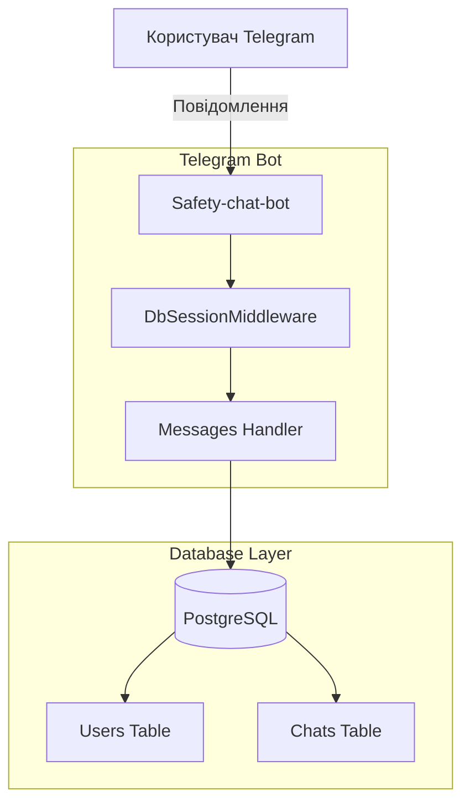

# 🛡️ Safety-chat-bot v0.5.0

[](https://github.com/weby-homelab/safety-chat-bot/releases)
[](https://hub.docker.com/r/webyhomelab/safety-chat-bot)
[](https://opensource.org/licenses/MIT)
[](https://www.python.org/)

Сучасний, легкий та повністю безкоштовний Telegram-бот для модерації та управління спільнотами. Побудований на базі **Aiogram 3** та **PostgreSQL**.

## ✨ Основні можливості

- **🛡️ Ефективна Модерація (Оновлення 06.2026):** Потужні евристичні фільтри миттєво реагують на нові методи спаму, фішинг-посилання (через розширені списки `BANNED_DOMAINS` з короткими лінками на кшталт `is.gd`, `t.co`, `bit.do`) та ворожі висловлювання/ІПСО.
- **👥 Авто-реєстрація:** Бот автоматично реєструє профілі для нових учасників чату при їх першій активності.
- **📢 Сповіщення Адміністратора:** Автоматичні сповіщення в окремий чат адміністратора про всі ключові події модерації (пройдена чи провалена капча, видалений спам, скарги користувачів через команду `/report`).
- **⚙️ Надійна Архітектура:** Використання SQLAlchemy 2.0, Alembic для міграцій та Docker для швидкого розгортання.
- **🔄 Динамічна та безпечна синхронізація:** Інкрементне додавання нових спам-фраз та заборонених доменів до бази даних при кожному запуску без затирання користувацьких змін.

## 🛡️ Оновлення Безпеки & Словник Захисту (Версія 0.5.0)

У червні 2026 року бот було суттєво модернізовано для захисту українських чатів від навали російських ботів, спаму та ворожих ІПСО:
1. **Максимальний словник фільтрації (`SPAM_KEYWORDS`):**
   * *Спам та схеми:* блокування пропозицій нелегального підробітку (`робота вдома`, `в день від`), реферальних посилань, казино, ставок (`1xbet`), та пропозицій написати менеджеру в приватні повідомлення.
   * *Шахрайські виплати:* автоматичне видалення повідомлень про фейкові соцвиплати українцям від ООН, Червоного Хреста, єПідтримки чи держорганів.
   * *Російська агресія та пропаганда:* жорстка фільтрація ворожих ІПСО, образ українців (`хохлы`, `укропы`), маркерів російської пропаганди (`сво`, `путин`, `денацификация`, `русский мир`) та дискредитуючих кампаній.
2. **Інтелектуальна нормалізація тексту (Heuristic Normalization):**
   * *Заміна омогліфів:* бот розпізнає та блокує слова, де кириличні літери замінено візуально схожими латинськими (наприклад, англійські `o`, `a`, `e` замість українських).
   * *Очищення від шумів:* видалення пробілів, крапок, зірочок та спецсимволів (наприклад, `к_р_и_п_т_а` розпізнається як `крипта`).
3. **Розумне сідування БД:** оновлена логіка ініціалізації БД автоматично виявляє та дописує нові слова зі словника за замовчуванням при оновленні версії бота, не перезаписуючи зміни, внесені адміністраторами вручну через інтерфейс.

## 🏗 Архітектура



## 🚀 Швидкий старт (Docker)

### Запуск однією командою:
```bash
curl -sSL https://raw.githubusercontent.com/weby-homelab/safety-chat-bot/master/run.sh | bash
```
або через `wget`:
```bash
wget -qO- https://raw.githubusercontent.com/weby-homelab/safety-chat-bot/master/run.sh | bash
```

### Ручне встановлення:

1. **Клонуйте репозиторій:**
   ```bash
   git clone https://github.com/weby-homelab/safety-chat-bot.git
   cd safety-chat-bot
   ```

2. **Налаштуйте `.env`:**
   ```bash
   cp .env.example .env
   # Вкажіть ваш BOT_TOKEN, DATABASE_URL, а також TELEGRAM_BOT_TOKEN_ADMIN та TELEGRAM_CHAT_ID_ADMIN для сповіщень
   ```

3. **Запустіть:**
   ```bash
   docker compose up -d
   ```

## 🛠 Технологічний стек

- **Python 3.11+**
- **Aiogram 3.x**
- **PostgreSQL** + **SQLAlchemy 2.0**
- **Alembic**
- **Docker** & **Docker Compose**

## 📝 Важливе налаштування
Для коректної роботи антиспаму, вимкніть **Group Privacy** у @BotFather та надайте боту права адміністратора на видалення повідомлень.

##

<p align="center">
  Built in Ukraine under air raid sirens &amp; blackouts ⚡<br>
  &copy; 2026 Weby Homelab
</p>
